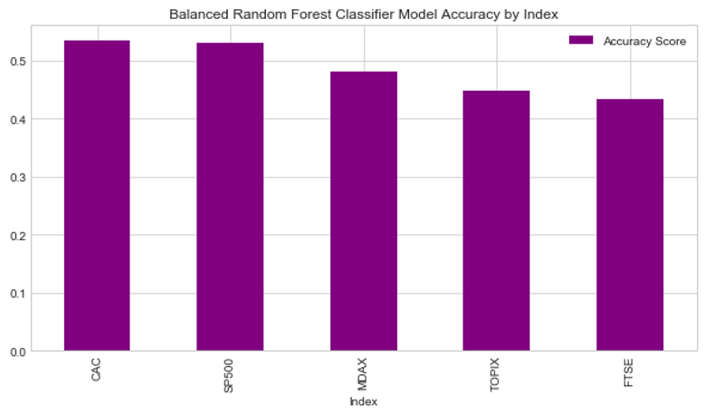
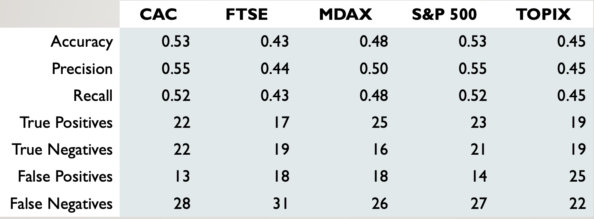

# Project Proposal - Predicting Global Markets Based on Sentiment

## Team Members:
1) Justin John  
2) Stephan Bernard   
2) Farah Awad   

## Project Outline: 
Using the Natural Language Processing features (sentiment & emotions) to feed into a machine learning model that will predict movement of stock prices & percent change in global markets. 

## Research Questions to Answer

- How do global markets fluctuate based on U.S news sentiment analysis of market indicies?
- Markets to predict daily percent change - SP500 (USA), FTSE 100 (UK), FCHI CAC 40 (FR), GDAXI (GER), TOPIX (Japan)
- How are major global markets going to perform in the next 5 days?

## Data sources to be used
- New York Times: https://developer.nytimes.com/apis
- Google Finance: Global Indices Stock Prices

## Evaluation Metrics 

### Balanced Random Forest: Accuracy by Index:
8

### Top Five Emotions (by Index):
8

### Classification Model: 
8

### Log-cosh: 
8
 
### Mean Squared Error:
8

## Results: Close Price (LSTM Model)

### S&P 500 (US):
8

### FTSE (UK):
8
 
 
 ## Results: Percent Change (LSTM Model)

### S&P 500 (US):
8

### FTSE (UK):
8

## Natural Language Processing (Word Cloud)

8

## Machine Learning Models & NLP Kits
 - IBM Watson NLP https://www.ibm.com/cloud/watson-natural-language-understanding
 - LSTM Model
 - Balanced Random Forest Classifier Model

## Conclusion/Postmortem
- We discovered that the news source New York Times’ (Headlines and Lead Paragraph) was heavily negative sentiment when doing NLP.
- We didn’t see much of a correlation between U.S. news and global stock market indices.
- Looking at the Top Five Emotions for each index, majority of the emotions are negative.
      - Can be a timing issue of the scope of the project (10/13– 1/13)
- We should’ve used more news sources (Bloomberg, CNBC or Wall Street Journal) to get varying news opinions rather than just the NYT.

## Task Breakdown
- Fetch 90 days worth of closing price data for global indicies using Quandl API
- Fetch 90 days worth of news data using Google News API or other
- NLP - sentiment analysis using IBM Watson to score current
- Machine Learning (create model, fit model, evaluate model and show predictions)- use any model that you see fit(one or more)
